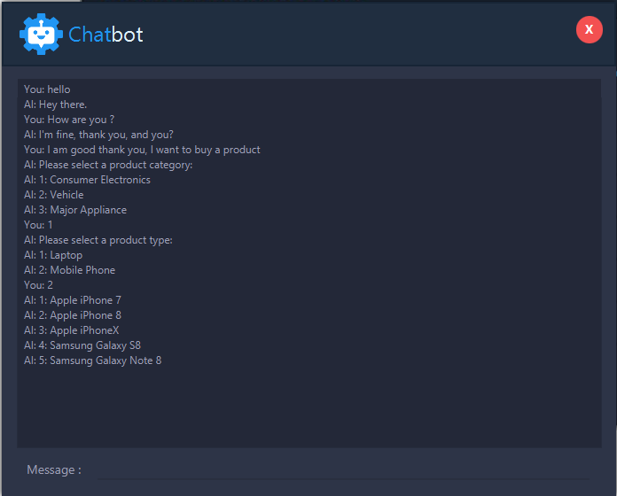
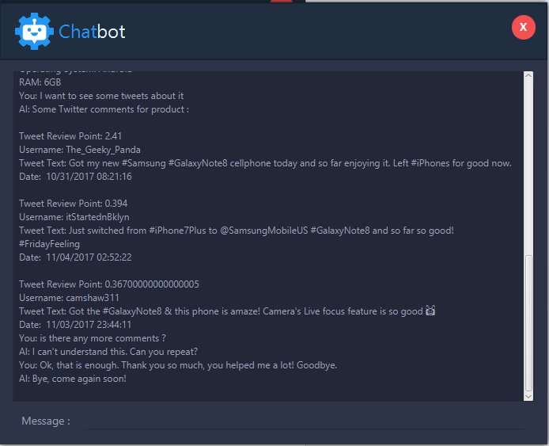

# Chatbot
Simple Chatbot app project for online stores. Products in the store are evaluated based on sentiment analysis from real tweet comments. Chatbot interacts with the customers and gives a suggestion according to sentiment analysis results for selected products.

# Tech Stack and External Libraries
- JavaFX
- FXML
- CSS
- Redis
- Twitter4J
- MongoDB
- SenticNet

# Sample Scenario

